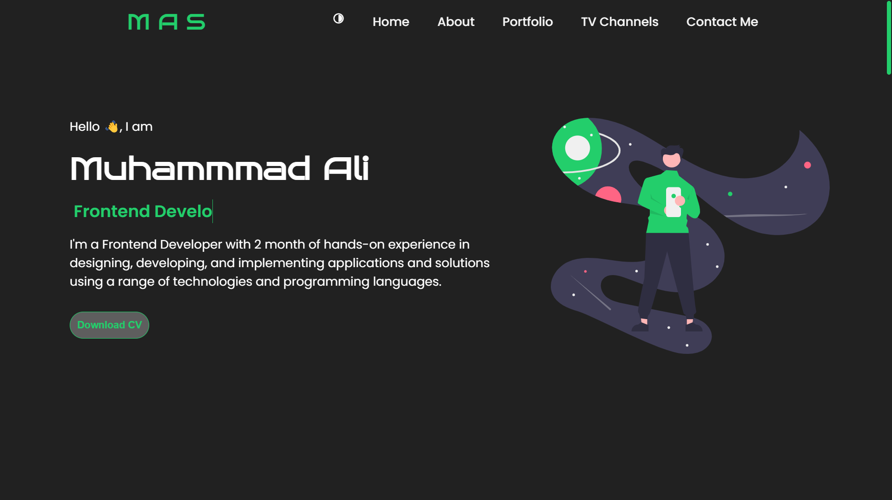
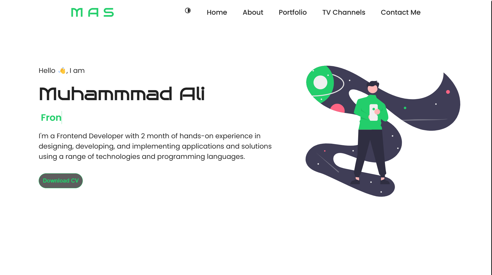

🚀 Personal Portfolio
Welcome to my personal portfolio! 🎉
This project showcases my skills, projects, and experiences as a passionate and dedicated developer. It serves as an interactive resume where you can explore my work, skills, and achievements.
🚀 Website Preview
Here’s a quick look at the website:

🌟 Features
Responsive Design: Works seamlessly on all devices.
Interactive UI: Engaging user experience with smooth navigation.
Project Showcase: Detailed descriptions of my projects with live demos and source code.
Contact Form: Get in touch with me directly from the website.

🛠️ Technologies Used
Frontend: HTML, CSS, JavaScript
Tools: Git, GitHub, VS Code

📬 Contact
Feel free to connect with me on LinkedIn or email me at itsalibro9@gmail.com.

